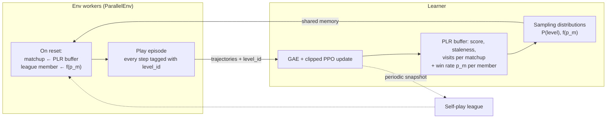
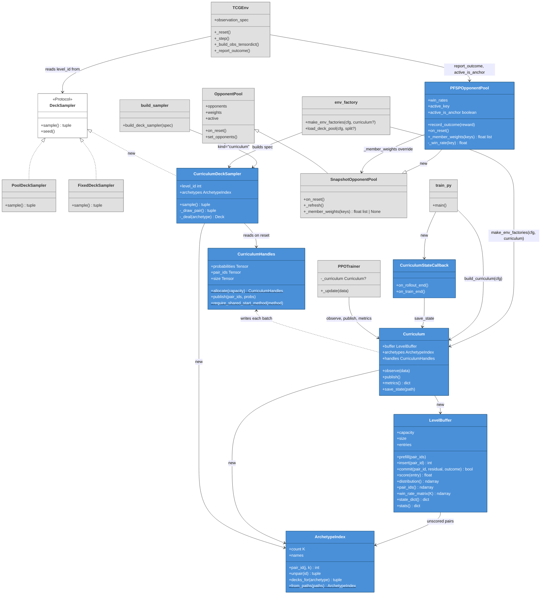

# Training curriculum design: prioritized level replay over matchups

Design for an adaptive training distribution over the Pokémon TCG environment, adapting
Prioritized Level Replay (PLR; Jiang et al., 2021) and Prioritized Fictitious Self-Play
(PFSP; Vinyals et al., 2019) to the Kaggle competition setting.

## Overview

Two things that currently vary uniformly per episode are instead drawn from prioritized
distributions:

- the **matchup** — the pair of decks the two seats play — by PLR, from a replay buffer of
  scored matchups;
- the **opponent's policy** — which frozen league snapshot occupies the opposing seat — by
  PFSP, weighted by the learner's win rate against each member.

The learner owns both, since it is the only process that sees advantages grouped by level,
and republishes the sampling distributions to the workers each batch through shared memory.
PPO itself is untouched; this is purely a reshaping of which episodes get played.

The loop closes once per batch: episodes finish and are scored by level, scores update the
buffer and its sampling distribution, and workers sample from the fresh distribution on
their next reset.

## Procedure

**0. Setup (once).** Fetch the corpus. The archetype ID is the `decks/<archetype>/` folder
name — no clustering step. Start the champion ladder at **C₀ = random agent + a fixed
reference deck**.

**1. Train the generalist.** One run: PLR buffer over archetype pairs (Sections 4–6) plus
PFSP over the self-play league (Section 7). Each buffer entry also accumulates win/loss
counts, restricted to episodes played against the frozen anchor opponent. Produces
checkpoint **G**.

**2. Pick the deck.** Build the matchup matrix from those counters over the last ~20% of
training. Rank archetypes by field-weighted win rate, with the field prior from
`manifest.json`. Play G piloting the top 6–8 against *every* champion on the ladder. Take
the best mean win rate, unless another candidate has a clearly better worst case — the
tournament field is unknown. Pick that archetype's best concrete list.

**3. Promote.** If (G, chosen deck) beats the top champion convincingly, append it to the
ladder. If it cannot beat C₀, stop and debug; nothing downstream is meaningful.

**4. Submit.** Write the 60 card IDs to `deck.csv`, export G into `main.py`'s inference
path, verify the `main.py` encoder is byte-identical to the training encoder on the
committed fixtures, and confirm a local win over C₀.

**Iterate.** The next run is scored against the extended ladder, so every cycle is measured
against a strictly higher bar.

Build order: PFSP first — biggest gain, smallest change — then the buffer. The win/loss
counters are three integers per entry, cost nothing, and step 2 depends on them, so add
them from the start.

## 1. Motivation

The environment already varies two things per episode: the deck matchup, drawn by
`PoolDeckSampler` (`src/env/deck_sampler.py`), and the self-play league member, drawn by
`OpponentPool` (`src/env/opponent_pool.py`). Both are sampled uniformly. That is domain
randomization: equal training time on matchups the policy already wins comfortably and on
matchups it never wins, even though only the latter carry gradient signal.

The competition objective is generalization to a field we cannot observe — other Kaggle
submissions, playing decks we did not choose. That is exactly the quantity unsupervised
environment design targets: zero-shot transfer to unseen levels. The training distribution
is therefore worth designing rather than sampling flat.

## 2. Background

### 2.1 Prioritized Level Replay

PLR applies to any environment that can be instantiated in many configurations. Each
configuration is a **level**: a maze layout in the original paper, a non-stationarity
schedule in the NS-Gym work, a deck matchup here. The default is to sample levels
uniformly. PLR replaces that with sampling proportional to an estimate of each level's
**learning potential**.

Its components:

1. **A scoring function**, evaluated on the episode just played. Canonically derived from
   the value function — mean absolute GAE advantage, or positive value loss. A large
   residual means the critic still misjudges this level, so there is something left to
   learn from it; once the level is learned, the score decays on its own.
2. **A buffer of up to $N$ scored levels.** The level space is generally far larger than
   $N$, so the buffer holds a curated subset rather than tabulating everything. Each entry
   carries a running score $S_i$, a visit count $n_i$, and a staleness counter $c_i$.
3. **A replay/explore split.** At each episode boundary, with probability $p_r$ a buffered
   level is replayed; otherwise a fresh level is sampled from the level space and inserted,
   evicting the lowest-scoring entry when the buffer is full.
4. **A rank-based sampling distribution** for replay,

   $$P_S(i) \;\propto\; \left(\frac{1}{\mathrm{rank}_i}\right)^{1/\beta}$$

   where $\mathrm{rank}_i$ is the position of $S_i$ in descending order and $\beta$ is a
   temperature. Rank rather than raw score makes selection scale-invariant, which matters
   because residual magnitudes shrink over training.
5. **A staleness term** $P_C(i) \propto c_i$, mixed in with weight $\rho$, forcing periodic
   revisits so no entry's score silently stops describing the current policy.

Two properties are often misread. PLR is a **training-distribution** method: the RL
algorithm is untouched, so it composes with PPO without modification. And it is **not a
sequential curriculum** — no mastery gate, no ordering, no "moving on". Every buffered
level stays eligible at every episode boundary; a learned level is demoted only because its
score decayed, and staleness pulls it back if the policy regresses.

### 2.2 Prioritized Fictitious Self-Play

PFSP applies to two-player games trained by self-play. Playing only against the current
policy fails on non-transitive games: the policy drifts to counter its present self,
forgets the counter to what it used to be, and cycles. **Fictitious self-play** fixes this
by playing against a league of frozen past snapshots, retaining history so the cycle cannot
close.

PFSP samples that league non-uniformly. Member $m$ is weighted by $f(p_m)$, where $p_m$ is
a running estimate of the learner's win rate against $m$. Two standard choices:

$$f(p) = (1-p)^\eta \qquad\text{(concentrate on members that beat the learner)}$$

$$f(p) = p(1-p) \qquad\text{(concentrate on members the learner is even with)}$$

As the league grows, most members become obsolete, and uniform sampling spends an
ever-larger share of episodes on games decided at reset.

### 2.3 The common structure

PLR and PFSP are the same operation on different axes: replace uniform sampling of a
variable that defines the episode with sampling prioritized by an estimate of learning
potential. PLR does it to the environment configuration, PFSP to the opponent. This design
applies that operation twice, which is why the two are specified together rather than as
separate features.

## 3. Levels and hyperparameters

The natural test for whether a quantity belongs in the level space is whether it varies at
deployment outside our control:

| | Varies at test time | Chosen by us |
|---|---|---|
| Opponent deck | yes | no |
| Opponent policy | yes | no |
| Seat / who plays first | yes | no |
| Shuffle | yes | no |
| Agent deck | **no** | **yes** |

By that test the agent's deck is a hyperparameter: fixed at submission and chosen by us, so
we maximize over it ($\max_h \max_\pi \mathbb{E}[\cdot]$) rather than integrate over it
($\max_\pi \mathbb{E}_{\ell}[\cdot]$). That governs the *submission* decision only. The
training distribution must vary it regardless, because self-play couples the two sides: the
opponent is a frozen snapshot of the learner, so the decks it can competently pilot are
exactly the decks the learner trained on. Fix the agent to deck $A$ and every snapshot is
an $A$-specialist; asked to pilot $B$ it plays legally but badly, since the encoder is
card-ID generic and nothing errors. The bias then runs the wrong way — decks furthest from
$A$ are piloted worst, so they look easiest, so PLR deprioritizes matchups involving them.

A level is therefore the full matchup, both seats, and the agent's side of it exists partly
to give the league **even piloting competence across the corpus**.

Two costs are accepted:

- **Late-training blindness.** The score measures critic error, not policy competence, so a
  level the policy is bad at but *predictably* bad at scores zero and is dropped. That
  requires a converged critic on that level, so it is a late-run failure rather than a
  general one; high staleness weighting (Section 6) is the only recovery mechanism.
- **No coverage guarantee on the agent's side.** A prioritized buffer over matchups can
  concentrate on a handful of agent decks, which reintroduces the coupling failure above in
  milder form. Staleness mitigates it; if it shows up in practice, the direct fix is a
  coverage floor on the explore path — sample fresh levels so as to even out per-archetype
  agent-side visit counts rather than uniformly at random.

## 4. Level space

A level is a pair of **deck archetypes**, one per seat:

$$\ell \;:=\; (j, k) \;\in\; \{1, \dots, K\}^2$$

where $j$ indexes the agent's archetype, $k$ the opponent's, and $K$ is the number of
archetypes in the corpus. Two decisions here, and they are independent of each other.

### 4.1 Archetypes, not deck lists

An **archetype** is a group of lists that win the same way with the same core engine —
"Charizard ex", "Gardevoir ex", "Lost Box". Lists within one share roughly 50–55 of their
60 cards; the rest are flex slots teched for the expected field. Operationally there is no
judgement call and no clustering step: tournament sites label decks by archetype and the
corpus carries those labels in its directory layout, so **the archetype ID is the name of
the folder the CSV sits in** (`_load_manifest_for`, `src/training/env_factory.py:125`,
already assumes that layout). If a fetched corpus turns out flat, fall back to grouping by
card overlap — same archetype at Jaccard similarity above ~0.8 on the 60-card multisets.

Levels are keyed by archetype, not by individual list. Two lists of the same archetype play
nearly identically, so per-list scores would mostly be measuring noise between
near-duplicates, and the corpus (~$10^3$ lists) would spread ±1 outcomes far too thin to
score anything reliably. In practice $K \sim 30$–$50$, which is $20$–$50\times$ more
episodes per entry and moves the point where scores carry signal rather than noise from
~$10^7$ frames down to ~$10^5$.

Archetype also decouples entry count from corpus size: the corpus grows through versioned
`decks-vN` releases, but new lists are overwhelmingly variants of existing archetypes, so
$K$ grows far more slowly than $|D|$. When a level is selected, a concrete list is drawn
uniformly from within archetype $j$ and $k$, so list-level diversity is preserved without
being scored.

**Entries must be keyed by a stable archetype identifier**, not by a dense index into a
loaded list. A corpus update otherwise reshuffles indices and silently invalidates every
score and any checkpointed curriculum state.

### 4.2 A buffer, not a table

The pair space is $K^2$, today ~$10^3$ entries, which would fit in a full table. We use a
buffer anyway, because a full table is exactly what a buffer degenerates to when its
capacity $N$ exceeds the number of reachable levels: set $N$ generously (~2000) and at
present corpus size nothing is ever evicted, explore simply fills the table, and
interactions are scored directly with no attribution problem.

The buffer earns its keep as the space grows. $K$ rises with each set release and $K^2$
rises quadratically — $K = 30$ is 900 entries, $K = 60$ is 3600, past the point where every
cell can carry a trustworthy ±1-derived score. Beyond that, eviction
and the replay/explore split start doing their intended job with no change to the
implementation. ACCEL (Section 10) would reopen the space without bound, and the buffer is
the only structure that survives it.

Scoring the pair rather than two per-seat marginals is deliberate. Matchup interactions are
the signal in card games — deck A against B is a genuinely different problem from A against
C, and archetype matchup tables *are* the competitive meta. Marginals would discard exactly
that.

## 5. Scoring

Let

$$\delta_t \;=\; \hat{V}^{\mathrm{targ}}_t - V(s_t)$$

be the critic residual at step $t$ (the tensordict keys `value_target` and `state_value`).
For a buffered level with $n$ prior visits and an episode of length $T$, write
$\bar{\delta}$ for the running mean residual:

$$\bar{\delta} \;\leftarrow\; (1-\alpha)\,\bar{\delta} \;+\; \alpha \cdot \frac{1}{T}\sum_{t=1}^{T} \delta_t,
\qquad \alpha = \frac{1}{n + 1}$$

$$S \;=\;
\begin{cases}
\lvert \bar{\delta} \rvert & \text{if } n \ge n_{\min} \\[2pt]
S_{\max} & \text{otherwise}
\end{cases}$$

The absolute value is taken **after** averaging across visits, not before:
$\lvert \bar{\delta} \rvert$, not $\overline{\lvert \delta \rvert}$. This is the one
substantive departure from canonical PLR and it is forced by the reward structure. Reward
is terminal-only $\pm 1$ (`src/env/tcg_env.py`) over episodes of $\sim\!10^2$ decisions,
and outcome variance is dominated by shuffle, prizes and coin flips. Under the canonical
score $\overline{\lvert \delta \rvert}$, a matchup that is a genuine coin flip scores high
permanently: the critic correctly predicts $0$ and the outcome is $\pm 1$ every episode, so
the residual never shrinks. PLR would concentrate the entire budget on the highest-variance
matchups, which are precisely those with the least to learn.

Averaging the *signed* residual first cancels the aleatoric component, which is zero-mean,
and leaves systematic critic bias — genuine epistemic signal that decays to zero once the
critic is unbiased on that level.

Three implementation constraints:

- Read `value_target` and `state_value`, not `advantage`. With `average_gae: true`
  (`conf/agent/ppo.yaml`) advantages are standardized per batch, which would make the score
  a batch-relative quantity.
- The visit floor $n_{\min}$ ($\sim\!5$–$10$ episodes) prevents a single lucky or unlucky
  episode from promoting or burying a level before its score means anything.
- **Entries below $n_{\min}$ must be exempt from eviction.** Otherwise noisy early scores
  drive eviction and new levels are churned out before they are ever measured. Evict the
  lowest scorer among entries that have passed the floor.

**Known limitations** are stated in Section 3.

**Ablation arm.** Learnability $p(1-p)$ on win rate (Rutherford et al., 2024) is the
alternative. It is coarser — one bit of outcome per episode rather than every timestep —
and it interacts badly with PFSP, which drives $p \to 0.5$ and pins the score near its
maximum everywhere. Worth measuring, not worth defaulting to.

## 6. Sampling

At each episode boundary, with probability $p_r$ replay a buffered level; otherwise sample
a fresh archetype pair and insert it. Replay draws from the standard PLR mixture:

$$P(i) \;=\; (1-\rho)\,P_S(i) \;+\; \rho\,P_C(i),
\qquad P_S(i) \propto \left(\frac{1}{\mathrm{rank}_i}\right)^{1/\beta},
\qquad P_C(i) \propto c_i$$

$\rho$ should be set well above the paper's $0.25$, for two reasons that compound here.
Under self-play the difficulty of a level changes even when the policy has not forgotten
it, because the league moves underneath it. And per Section 3, staleness is the only
mechanism that recovers a level the score has gone blind to.

While the buffer is under-filled relative to the reachable level count, exploration
dominates by construction and the buffer converges to the full table; $p_r$ only becomes
load-bearing once the space outgrows capacity.

## 7. Prioritized opponent selection

`OpponentPool` currently samples league members uniformly. Replace with PFSP as defined in
Section 2.2, tracking a running win rate $p_m$ per member.

This is the highest-value component and the cheapest. Two reasons it is not optional:

**Non-transitivity.** Archetype matchups in card games are rock-paper-scissors by
construction, so the cycling failure PFSP was designed for is the expected case here rather
than an edge case. A uniform league prevents cycling by retaining history, but as the
league grows the fraction still capable of threatening the learner shrinks, so a growing
share of episodes are decided at reset. PFSP is what makes retaining history affordable.

**It protects the PLR scores.** A hard matchup paired with an obsolete opponent policy is
still a trivial win, so the level's score would reflect opponent weakness rather than
matchup difficulty. Prioritizing one axis while leaving the other uniform lets them cancel.

### 7.1 Decoupling the two prioritized axes

Running both together introduces one confound. An episode is a pair (level $\ell$, league
member $m$), and a large residual could mean $\ell$ is hard or $m$ is strong — but PLR
credits it entirely to $\ell$. As PFSP shifts the league toward stronger opponents,
residuals inflate across all levels, and not uniformly: a stronger opponent costs more in
some matchups than others, so ranks move for reasons unrelated to matchup difficulty.

Rank-based sampling absorbs the uniform part of that inflation, and high $\rho$ forces
re-measurement under the current league, but neither removes it.

The fix is to **condition PLR scoring on a stationary opponent**: update $\bar{\delta}$
only on episodes played against a fixed reference subset of the league — the permanent
random opponent plus a designated anchor snapshot, neither of which moves with the learner.
Episodes against PFSP-drawn members still train the policy and still update $p_m$; they
simply do not contribute to level scores. The cost is that a fraction of episodes carry no
scoring signal, which slows buffer warm-up; the benefit is that level scores become
comparable across training rather than drifting with league strength.

Log the diagnostic first — correlation between drawn-opponent strength and level score
drift — and enable the conditioning if it is material. It is a flag on the scoring path,
not a structural change.

## 8. Implementation

Scoring is centralized in the learner rather than replicated per worker. Episodes here run
$\sim\!10^2$ agent decisions against `frames_per_batch / num_workers` $\approx 256$ steps
per worker per batch, so episodes straddle batch boundaries and roughly one completes per
worker per batch. A per-worker scheme that writes one scalar per worker per batch and
attributes it to whichever level that worker starts next cannot align scores with levels
under those conditions.

- `TCGEnv` adds `level_id` to `observation_spec` so every step carries its buffer entry
  through `ParallelEnv` and the collector into the learner, where grouping is exact.
- The learner owns the buffer: it consumes the post-GAE tensordict, groups residuals by
  `level_id`, and updates $\bar\delta$, $n$, $c$, handling insertion and eviction. It also
  increments per-entry win/loss/draw counters for episodes played against the anchor
  opponent — three integers, unused during training, and the basis of Section 9.
- Each batch it writes the resulting sampling distribution into a shared memory array.
  Workers read it and sample locally on reset, then draw a concrete deck list uniformly
  from within each chosen archetype. Sharing the distribution rather than handing out
  assignments avoids a per-worker queue and its staleness, since the learner cannot know
  when a worker will reset.
- A `CurriculumDeckSampler` implements the existing `DeckSampler` protocol
  (`src/env/deck_sampler.py`), so `TCGEnv` needs no change beyond emitting `level_id`.
- Curriculum statistics reach W&B through the existing `TrainingCallback` fan-out.

The buffer itself is a port of `PLRBuffer` from `nsgym-solution`
(`src/AAMAS_Comp/curriculum/plr.py`), with the score replaced per Section 5, the eviction
floor added, and the sampler decoupled.

## 9. Deck selection and evaluation

The run produces a generalist that pilots the whole corpus. Choosing the one list that
ships in `deck.csv` is a separate step, and most of the evidence for it is a free byproduct
of training.

**The matchup matrix comes from Phase 1.** Every episode has a known level $(j,k)$ and a
terminal outcome, so each buffer entry can carry win/loss/draw counters alongside its
score, giving $\widehat{W}[j][k]$ over far more games than a dedicated screening pass could
afford. Three conditions on reading it:

- Count only episodes against the **frozen anchor opponent** (§7.1), or the matrix mixes
  opponent strength across cells.
- Use only the **last ~20%** of training; earlier games reflect a weaker policy.
- Treat low-count cells as uncertain. PLR visits entries unevenly, so precision varies
  widely — though each cell's rate is still an unbiased estimate of that matchup, so the
  unevenness costs precision, not correctness.

Free consistency check: both seats are the same policy, so
$\widehat{W}[j][k] \approx 1 - \widehat{W}[k][j]$. Large violations indicate a seat or
counting bug.

**Do not rank on PLR scores.** They are critic residuals — high means the agent handles
that matchup *worst*.

**Ranking.** Score each archetype by $\sum_k q(k)\,\widehat{W}[j][k]$, with the field prior
$q$ from `manifest.json` (`_deck_weights`, `src/training/env_factory.py`). Treat the
manifest ranking as a cross-check, not an oracle: tournament data measures deck strength
for *human* pilots under time pressure and underrates decks an agent could execute
perfectly. Sharp disagreement between the two rankings is worth understanding before
proceeding.

**Final comparison** takes the top 6–8 candidates against every champion on the ladder,
~100 games per pairing, held-out lists, half going first. Rank on mean win rate across the
ladder, but prefer a candidate with a clearly better worst case: the tournament field is
other submissions, not the tournament meta, so a deck whose value depends on guessing $q$
correctly is a worse bet than one that is hard to blow out.

**No specialization stage.** Fine-tuning on the chosen deck requires freezing the league,
and a frozen opponent distribution is exactly the setup that produces overfitting — the
wrong trade when the field is unseen submissions. The generalist has piloted that deck
throughout Phase 1 and is not starting cold. If extra budget on the shortlist is wanted,
continue Phase 1 with the agent-side archetype draw biased toward the candidates, league
still growing.

Evaluation reuses existing machinery: `deck_holdout_frac` reserves unseen lists, and
`Evaluator` scores against a fixed reference opponent, which is required because the
collected win rate under self-play is pinned near $0.5$ by construction.

**Ablation arms**, in priority order:

| Arm | Purpose |
|---|---|
| Uniform `PoolDeckSampler` | Domain-randomization control; already implemented |
| + PFSP | Isolates the opponent-policy axis |
| + PLR over matchups | Isolates the matchup axis |
| Archetype vs per-list levels | Tests the granularity claim of §4.1 |
| Score: $\lvert \bar{\delta} \rvert$ vs $\overline{\lvert \delta \rvert}$ vs $p(1-p)$ | The central technical claim of Section 5 |

## 10. Deferred: ACCEL

ACCEL (Parker-Holder et al., 2022) extends PLR by mutating high-scoring levels rather than
only replaying them, so difficulty grows at the frontier of the policy's competence instead
of waiting for random search to find hard configurations. Applied here it would mean
mutating deck lists.

With the buffer in place it is a small addition — a mutation operator on the explore path,
not new infrastructure. What still argues against it: deck legality is engine-enforced (60
cards, $\ge 1$ basic Pokémon, $\le 4$ of a name except basic energy, $\le 1$ ACE SPEC,
known IDs; see `ptcg_engine/ptcgProgram 22/Api.h`) and would need mirroring in Python;
mutated lists have no archetype label, so they would have to be scored individually and
would break the granularity argument of §4.1; and unlike the NS-Gym setting there is a
ground-truth target distribution to drift away from, so adversarially bred decks may
resemble nothing in the Kaggle field. If built, crossover between corpus decks is a better
operator than card-level noise, with a cap on distance from the nearest corpus deck.

## 11. Priority

Honest ordering of what decides this competition: (1) the backbone — `src/models/transformer.py`
is empty and the trunk is an MLP; (2) opponent diversity under non-transitivity; (3) the deck
choice; (4) which matchups we train on. The curriculum is fourth. It shapes which states the
agent sees; the backbone decides whether it can tell them apart.

Build order follows: PFSP first, then the matchup buffer. They share all infrastructure.

## 12. Differences from the NS-Gym application

This design ports PLR's machinery from `nsgym-solution` but differs on several substantive
points, because the setting differs.

**What a level is.** There, a level is a non-stationarity specification — which physics
parameters drift, on what schedule, under what update function — and the difficulty is that
dynamics change mid-episode. Here the rules are fixed and there is no non-stationarity of
dynamics at all. The level is the *matchup*, and the problem is generalization across it.

**Where the level space comes from.** There it was continuous and invented from intuition
about each task's physics, with the resulting mismatch against the hidden competition
distribution named as the main limitation. Here it is finite, real, and drawn from the
tournament corpus — which removes that limitation, but also removes the freedom to invent
difficulty on demand.

**Granularity is a design choice.** There, a level is whatever the sampler emits. Here the
corpus is ~$10^3$ lists but only ~$30$–$50$ archetypes, and the choice of which to key on
directly determines whether scores carry signal under ±1 rewards. Clustering to archetypes
is what makes the buffer's entries estimable at all, and it is what keeps entry count
decoupled from a corpus that grows with each release.

**The score.** There, $\frac{1}{T}\sum_t \lvert \hat{A}_t \rvert$ works because return
variance is largely epistemic. Here it fails outright: terminal $\pm 1$ rewards over long
episodes make the score a measure of shuffle variance, which never decays. Averaging the
signed residual before taking its magnitude is the fix and is the single most important
adaptation in this document. The eviction floor (§5) exists for the same reason.

**Where scoring happens.** There, each worker owns an independent PLR buffer and reads a
per-worker scalar from shared memory, which is sound when many short episodes complete per
worker per batch. Here episodes are long and straddle batch boundaries, so the buffer is
centralized in the learner and only the sampling distribution flows back out.

**A second prioritized axis.** NS-Gym is single-agent; there is no opponent to prioritize.
Here PFSP on the self-play league is the higher-value half of the design, and it exists
because the game is two-player and strongly non-transitive.

**A quantity that is a level during training and a hyperparameter at deployment.** The
agent's own deck has no NS-Gym analogue: we choose it at submission, yet it must vary
during training because self-play makes the league's deck coverage identical to the
learner's (Section 3). Training therefore integrates over it while submission maximizes
over it, and the evidence for that maximization is collected during training rather than
after it (Section 9).

**Transferable but out of scope.** The paper's inference path (§3.5: direct network call,
NumPy forward, observation normalization folded into the first layer) applies directly to
the Kaggle `main.py` submission if there is a per-move time budget. It is orthogonal to the
curriculum and tracked separately.

## 13. Implementation

### 13.0 Class diagram

New classes in blue; existing classes they touch in grey.

### 13.1 Files

| File | Purpose |
|---|---|
| `src/env/archetype_index.py` | Groups the deck corpus by `decks/<name>/` folder. Matchups are identified as `agent * K + opponent`, stable regardless of buffer churn. |
| `src/env/level_buffer.py` | Port of `PLRBuffer` (nsgym-solution). Scores matchups by $\lvert\bar\delta\rvert$, exempts entries below `min_visits` from eviction, tallies anchor-game win/loss/draw alongside the score. Staleness is derived from a global episode counter (O(1) per update, distribution recomputed O(N) per batch). |
| `src/env/curriculum_handles.py` | Shared-memory channel: three `torch` tensors (`probabilities`, `pair_ids`, `size`), written by the learner and read by every worker on reset. Plain `share_memory_()` rather than a `Manager` proxy — under `fork` the children inherit the mapping and reads are just memory reads. Validates the start method at construction. |
| `src/env/curriculum_deck_sampler.py` | Implements the existing `DeckSampler` protocol. On `sample()`, reads the shared tensors, draws a slot by `torch.multinomial`, resolves it to two archetypes, deals a concrete list uniformly from within each. Empty channel falls back to uniform. Exposes `level_id` via the same duck-typing `getattr` pattern already used for `on_reset`. |
| `src/env/pfsp_opponent_pool.py` | `PFSPOpponentPool(SnapshotOpponentPool)`. Tracks per-member `(wins, games)` smoothed toward 0.5 by a `prior_games` prior, weights members by `(1-p)^η` (`hard`) or `p(1-p)` (`even`) plus a `min_weight` floor. Records keyed by snapshot path survive eviction. |
| `src/training/curriculum.py` | `Curriculum`: owns the buffer, consumes the post-GAE `(workers, time)` batch, carries a per-row open-episode accumulator across batch boundaries, commits at episode ends. Segments on `done` but decides outcomes on `terminated` — truncated runs are scored for their residual but not entered as phantom draws. `build_curriculum(cfg)` constructs from config. |
| `src/training/callbacks/curriculum_callback.py` | `CurriculumStateCallback`: atomic periodic dumps of the buffer's tallies, so Phase 2 deck selection can difference two dumps into any window. |
| `conf/env/curriculum.yaml` | Enables the curriculum on top of `multideck`. `python -m src.train agent=ppo env=curriculum train=ppo_selfplay`. |

### 13.2 Touch points

**`TCGEnv`.** `level_id` and `opponent_is_anchor` added to `observation_spec` — constant across an episode, invisible to the model (the backbone only reads its configured `in_keys`), read from the sampler and opponent via `getattr`. `_report_outcome` tells the pool how a finished game went, using the same duck-typed hook as `on_reset`.

**`PPOTrainer._update`.** Calls `curriculum.observe(data)` and `curriculum.publish()` immediately after `self._advantage(data)`, before the reshape, so the `(workers, time)` layout is intact for per-row episode segmentation. Merges `curriculum.metrics()` into the loss dictionary.

**`env_factory`.** `make_env_factories` accepts an optional `curriculum` and builds a `"curriculum"`-kind sampler spec when one is provided. The eval split (`deck_split="eval"`) ignores it, keeping the held-out read unbiased. `load_deck_pool` is shared by the factories and `build_curriculum` so both see the same split and same ordering.

**`SnapshotOpponentPool._refresh`.** Builds stable member keys and delegates weight computation to `_member_weights(keys)`, which returns `None` in the base class (uniform) and the PFSP weights in the subclass.

**`scripts/make_synthetic_corpus.py`.** Builds a type-based corpus from `EN_Card_Data.csv` when the tournament corpus is unavailable. Each deck is 20 Basic attackers of one energy type + 40 matching Energy. Used only when `gh` credentials are absent; the real corpus comes from `scripts/fetch_decks.sh` or `python -m scraper`.

### 13.3 Shared-memory transport

A level is two small integers (archetype indices). The learner writes the sampling distribution to three shared tensors after every batch; workers read it on every reset. `size` is written last, so a worker reading concurrently can never see a count that outruns the slots behind it. A torn read produces one episode sampled from a half-updated distribution, which is harmless.

This only works under `mp_start_method=fork` — `spawn` would pickle the tensors into private copies and the workers would never see an update. `CurriculumHandles.require_shared_start_method` validates this at construction, not silently.

## 14. Experimental setup

### 14.1 Training arms

| Arm | Config | Description |
|---|---|---|
| Uniform | `env=multideck train=ppo_selfplay` | Both seats' decks drawn uniformly from the training split. League sampled uniformly. |
| Curriculum | `env=curriculum train=ppo_selfplay` | Both seats' decks drawn from the PLR buffer over archetype pairs. League sampled by PFSP. |

Both arms share: the PPO hyperparameters, the model architecture, the deck corpus and holdout split, the collector configuration, and the seed.

### 14.2 Corpus

353 tournament deck lists across 50 archetypes, scraped from LimitlessTCG (`python -m scraper --source limitless --limit 50 --max-pages 0 --per-tournament 0 --since 2025-01-01 --max-decks 3000`). 20% of lists held out for evaluation (`deck_holdout_frac=0.2, deck_split_seed=0`). Archetype IDs are the folder names from the scraper's output layout.

### 14.3 Evaluation

Evaluated against a fixed reference opponent, not the live league. The reference comes from a checkpoint frozen during the **uniform** arm's training, so both policies face the same opponent at the same strength.

**Setup:**

- **Agent deck:** a single archetype both policies trained on (a high-count corpus archetype with a good tournament record), with its best concrete list fixed for all evaluation episodes.
- **Opponent deck:** drawn uniformly from the **held-out** split (`deck_split="eval"`), independent matchup — the opponent's seat gets a deck the agent never trained against.
- **Opponent policy:** a frozen league snapshot from the uniform arm, loaded as a greedy opponent. Both policies are scored against the identical set of snapshots.
- **Policy mode:** deterministic (argmax).

**Metrics reported:**

- **Mean win rate** over the (held-out deck × frozen snapshot) pairs. Measures overall generalization.
- **Worst-decile win rate** — the mean across the lowest 10% of pairings. The curriculum's specific claim is that it raises the floor on the matchups the policy handles worst; worst-decile isolates that signal from the mean, where both arms may look similar.

The random opponent stays as a sanity check: if either arm cannot beat `RandomOpponent` on held-out decks, stop and debug. Once both pass ~0.7, the random baseline is saturated and the snapshot-based evaluation carries the signal.

## References

- Jiang, Grefenstette & Rocktäschel (2021). Prioritized Level Replay.
- Parker-Holder et al. (2022). Evolving Curricula with Regret-Based Environment Design (ACCEL).
- Rutherford et al. (2024). No Regrets: Investigating and Improving Regret Approximations for Curriculum Discovery.
- Vinyals et al. (2019). Grandmaster level in StarCraft II using multi-agent reinforcement learning (PFSP).
- Ferrao & Van Der Lende. Non-Stationarity as Levels: Unsupervised Environment Design for Robust Reinforcement Learning.
